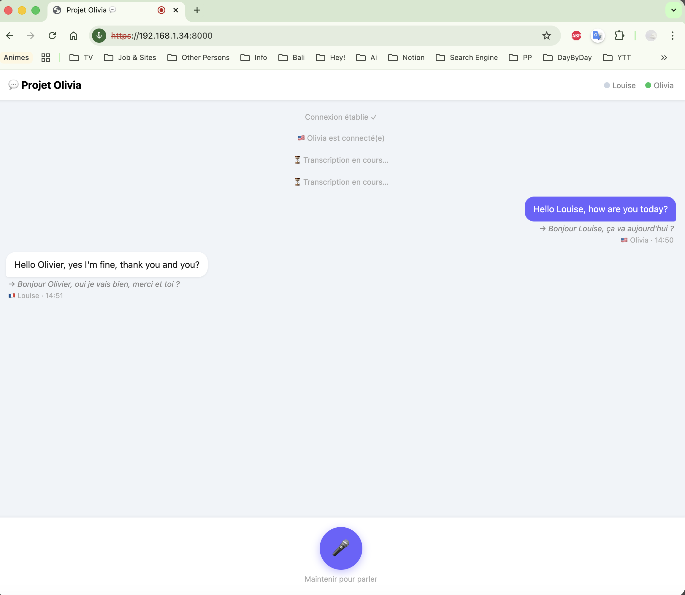
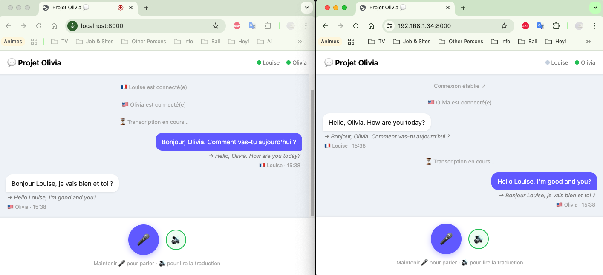
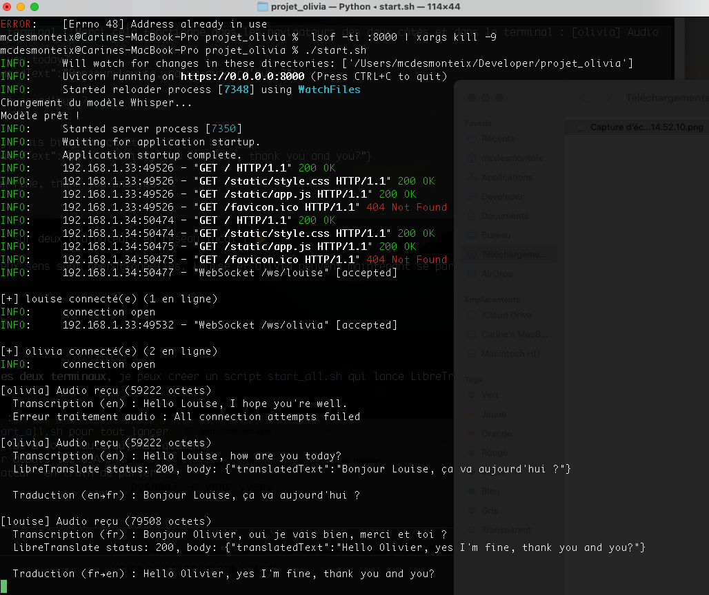
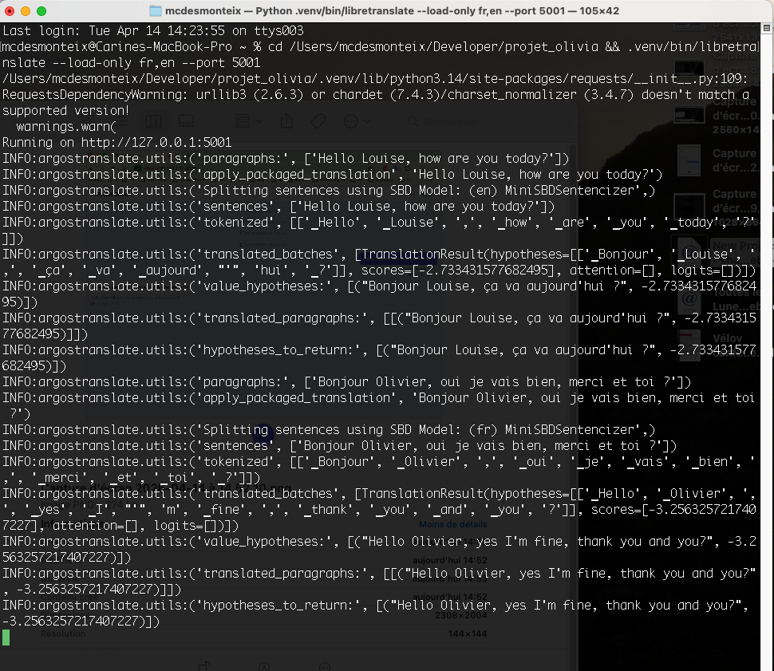

# 💬 Projet Olivia


Application de conversation bilingue en temps réel, permettant à deux personnes de se parler malgré la barrière de la langue.

**Exemple d'usage :** Louise (🇫🇷 français) et Olivia (🇺🇸 anglais) peuvent se parler naturellement — chacune parle dans sa langue, l'autre voit la traduction instantanément.

## 🎬 Démonstration

<video src="docs/media/demo.mov" controls width="100%"></video>

> Si la vidéo ne s'affiche pas, [cliquez ici pour la télécharger](docs/media/demo.mov).

## 📸 Captures d'écran

<table>
  <tr>
    <td align="center"><b>Écran de sélection</b></td>
    <td align="center"><b>Conversation en temps réel</b></td>
  </tr>
  <tr>
    <td></td>
    <td></td>
  </tr>
  <tr>
    <td align="center"><b>Vue Olivia (EN)</b></td>
    <td align="center"><b>Logs serveur</b></td>
  </tr>
  <tr>
    <td></td>
    <td></td>
  </tr>
</table>

## 🌍 Langues supportées

    | Langue | Code | Statut |
    |--------|------|--------|
    | Français | `fr` | ✅ Supporté |
    | Anglais  | `en` | ✅ Supporté |
    | Italien  | `it` | 🔜 Prochainement |
    | Espagnol | `es` | 🔜 Prochainement |
    | Allemand | `de` | 🔜 Prochainement |

## ✨ Fonctionnalités

- 🎤 **Transcription vocale** locale via [Whisper](https://github.com/openai/whisper) (faster-whisper)
- 🌍 **Traduction bidirectionnelle** FR ↔ EN via [LibreTranslate](https://libretranslate.com/) (100% local)
- 🔄 **Temps réel** via WebSockets
- 🌐 **Interface web** — aucune installation côté client
- 🔒 **100% local** — aucune donnée envoyée sur internet
- 🖥️ **Cross-platform** — fonctionne sur Mac, Windows, Linux

## 🏗️ Architecture

```
Utilisateur A (parle) → Whisper (transcription) → LibreTranslate (traduction) → Utilisateur B (lit)
                                    ↕ WebSocket temps réel
Utilisateur B (parle) → Whisper (transcription) → LibreTranslate (traduction) → Utilisateur A (lit)
```

## 📋 Prérequis

- Python 3.11+ — [python.org](https://python.org)
- FFmpeg — [ffmpeg.org](https://ffmpeg.org)
- mkcert — [github.com/FiloSottile/mkcert](https://github.com/FiloSottile/mkcert)
- ~600 Mo d'espace disque (modèles Whisper + LibreTranslate)
- Microphone

## 🚀 Installation

### 🍎 macOS

```bash
git clone https://github.com/mcdesmonteix/projet-olivia.git
cd projet-olivia
chmod +x setup.sh start_all.sh
./setup.sh
```

Le script installe automatiquement les dépendances via Homebrew et télécharge les modèles.

### 🪟 Windows

1. Installer [Python 3.11+](https://python.org/downloads/), [FFmpeg](https://ffmpeg.org/download.html) et [mkcert](https://github.com/FiloSottile/mkcert/releases)
2. Cloner le projet et ouvrir un terminal dans le dossier :
```bat
git clone https://github.com/mcdesmonteix/projet-olivia.git
cd projet-olivia
python -m venv .venv
.venv\Scripts\pip install -r requirements.txt
```
3. Télécharger les modèles Whisper et LibreTranslate :
```bat
.venv\Scripts\python -c "from faster_whisper import WhisperModel; WhisperModel('small')"
.venv\Scripts\libretranslate --load-only fr,en --update-files
```

## ▶️ Lancement

### 🍎 macOS — une seule commande

```bash
./start_all.sh
```

Lance LibreTranslate et le serveur automatiquement. L'IP locale est détectée et affichée.

### 🪟 Windows — deux terminaux

**Terminal 1 :**
```bat
.venv\Scripts\libretranslate --load-only fr,en --port 5001
```

**Terminal 2 :**
```bat
REM Trouver son IP locale
ipconfig
REM Générer le certificat SSL (remplacer TON_IP)
mkcert TON_IP localhost 127.0.0.1
REM Lancer le serveur
.venv\Scripts\uvicorn main:app --host 0.0.0.0 --port 8000 --ssl-certfile TON_IP+2.pem --ssl-keyfile TON_IP+2-key.pem
```

---

**Utilisateur A** ouvre : `https://localhost:8000`  
**Utilisateur B** ouvre : `https://[IP-affichée]:8000`

> La première fois, le navigateur affiche un avertissement SSL (certificat auto-signé). Cliquer sur "Paramètres avancés" → "Continuer".

## 🌍 Utilisation sur internet (longue distance)

Pour une connexion entre deux pays, utilise [ngrok](https://ngrok.com/) :

```bash
# macOS
brew install ngrok
# Windows : télécharger sur ngrok.com

ngrok config add-authtoken TON_TOKEN
ngrok http 8000
```

Partage l'URL générée (`https://xxx.ngrok-free.app`) avec l'autre utilisateur.

## 📁 Structure du projet

```
projet-olivia/
├── main.py              # Serveur FastAPI + WebSockets + Whisper + LibreTranslate
├── start.sh             # Script de lancement (détecte l'IP automatiquement)
├── setup.sh             # Script d'installation automatique (macOS)
├── requirements.txt     # Dépendances Python
└── static/
    ├── index.html       # Interface web
    ├── style.css        # Styles
    └── app.js           # Logique WebSocket + enregistrement audio
```

## 🗺️ Roadmap

- [x] POC — conversation FR ↔ EN sur réseau local (validé le 14/04/2026)
- [x] Synthèse vocale (TTS) — lecture automatique des traductions
- [x] Script de démarrage unique (`./start_all.sh`)
- [ ] Support d'autres langues (ES, DE, IT…)
- [ ] Test sur internet via Ngrok
- [ ] App Electron / PWA mobile

## 📄 Licence

MIT — libre d'utilisation, modification et distribution.
